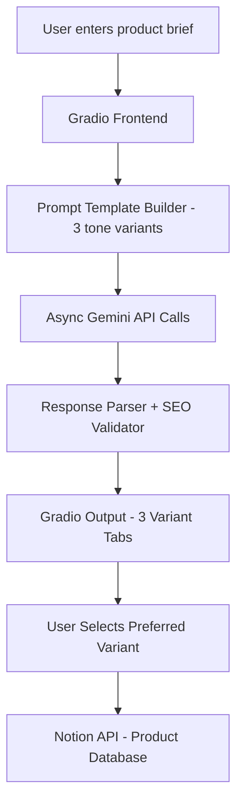

# 🛍 Project 3 — Product Description Generator


## 🧩 Business Problem

E-commerce businesses need unique, SEO-optimized product descriptions for hundreds of SKUs.

Hiring copywriters at scale is expensive — a mid-sized Shopify store with 500 products may spend thousands of dollars on a single copywriting sprint.

## 🎯 Project Objective

Build a Gradio application that accepts a product brief and generates **three tone-distinct product descriptions**:

* Professional
* Playful
* Urgency-driven

The application also generates an SEO meta description and saves the preferred variant into a Notion product database.

The application uses **Google Gemini 2.5 Flash through the OpenAI-compatible API interface** with asynchronous parallel generation.

---

# 🏗 System Architecture



---

# 🛠 Tech Stack

| Layer            | Tool                                           |
| ---------------- | ---------------------------------------------- |
| LLM              | Google Gemini 2.5 Flash                        |
| API Client       | OpenAI Python SDK (Gemini Compatible Endpoint) |
| Frontend         | Gradio                                         |
| Async Processing | asyncio + AsyncOpenAI                          |
| CMS Database     | Notion API                                     |
| Language         | Python 3.10+                                   |

---

# 📁 Folder Structure

```
project-03-product-description-generator/

├── app/
│   ├── app.py                  # Gradio UI + async orchestration
│   ├── prompt_templates.py     # Tone-specific prompt builders
│   └── notion_writer.py        # Notion database integration
│
├── tests/
│   └── test_templates.py
│
├── samples/
│   └── sample_products.json
│
├── .env.example
├── requirements.txt
└── README.md
```

---

# ⚙️ Setup

## 1. Clone Repository

```bash
git clone <your-repo-url>

cd project-03-product-description-generator
```

---

## 2. Create Virtual Environment

```bash
python -m venv venv

source venv/bin/activate
```

Windows:

```bash
venv\Scripts\activate
```

---

## 3. Install Dependencies

```bash
pip install -r requirements.txt
```

`requirements.txt`

```
openai>=1.30.0
gradio>=4.0.0
notion-client>=2.2.0
python-dotenv>=1.0.0
tiktoken>=0.7.0
pytest>=8.0.0
```

---

# 🔑 Environment Configuration

Create:

```bash
cp .env.example .env
```

`.env`

```env
GOOGLE_API_KEY=your-gemini-api-key

NOTION_TOKEN=your-notion-token

NOTION_DATABASE_ID=your-database-id
```

---

# 🔐 Getting API Keys

## Google Gemini API Key

1. Open Google AI Studio
2. Navigate to API Keys
3. Create a new API key
4. Add it to `.env`

Example:

```env
GOOGLE_API_KEY=AIzaxxxxxxxxxxxx
```

---

## Notion Token

1. Go to Notion Integrations
2. Create a new integration
3. Copy the Internal Integration Token
4. Add it:

```env
NOTION_TOKEN=secret_xxxxxxxxx
```

---

## Notion Database ID

Create a Notion database with:

| Property     | Type      |
| ------------ | --------- |
| Product Name | Title     |
| Tone         | Select    |
| SEO Meta     | Rich Text |
| Status       | Select    |

Recommended Select values:

Tone:

```
Professional
Playful
Urgency
```

Status:

```
Draft
Approved
```

Share the database with your Notion integration.

Database URL:

```
notion.so/<database-id>?v=<view-id>
```

Copy only:

```
database-id
```

---

# 🤖 Gemini API Integration

Google Gemini provides an OpenAI-compatible API endpoint.

The application still uses:

```python
from openai import AsyncOpenAI
```

but connects to Gemini:

```python
client = AsyncOpenAI(
    api_key=os.getenv("GOOGLE_API_KEY"),
    base_url="https://generativelanguage.googleapis.com/v1beta/openai/"
)
```

---

# ⚡ Async Parallel Generation

The application generates all three variants simultaneously.

Example:

```python
async def generate_all(...):

    prompts = [
        build_prompt(..., tone)
        for tone in TONES
    ]

    return await asyncio.gather(
        *[generate_single(prompt) for prompt in prompts]
    )
```

Instead of:

```
Professional → wait
Playful → wait
Urgency → wait
```

It executes:

```
Professional
Playful
Urgency

        ↓

Gemini API
```

at the same time.

---

# 🧠 Prompt Engineering

Each tone has a specific writing persona.

Example:

Professional:

```
authoritative, benefit-focused, polished
```

Playful:

```
friendly, conversational, human
```

Urgency:

```
action-oriented, creates desire and FOMO
```

The prompt also enforces:

* 150-200 word description
* SEO optimized content
* Meta description under 155 characters

---

# ▶️ Run Application

From project root:

```bash
python app/app.py
```

Gradio launches:

```
http://127.0.0.1:7860
```

---

# 🧪 Testing

Run:

```bash
pytest tests/ -v
```

---

# 🛠 Troubleshooting

| Error                            | Cause                    | Solution                               |
| -------------------------------- | ------------------------ | -------------------------------------- |
| `403 PermissionDenied`           | Invalid Gemini key       | Create a new Gemini API key            |
| `API key reported as leaked`     | Key exposed publicly     | Revoke key and generate a new one      |
| `Model not found`                | Wrong Gemini model       | Use `gemini-2.5-flash`                 |
| `Could not find database`        | Wrong Notion database ID | Verify database ID                     |
| `Could not find integration`     | Notion not shared        | Add integration connection             |
| Notion property validation error | Property type mismatch   | Match API payload with database schema |

---

# 📊 Evaluation Rubric

| Criteria        | Meets                  | Exceeds                    |
| --------------- | ---------------------- | -------------------------- |
| Functionality   | Three product variants | Custom tones + Notion save |
| Code Quality    | Modular architecture   | Async generation + tests   |
| LLM Integration | Gemini API             | Provider abstraction       |
| Documentation   | README                 | Deployment guide           |
| Business Value  | SEO automation         | Enterprise scaling         |

---

# 🎤 Interview Talking Points

## Why three tones instead of one?

Different brands require different marketing styles. Multiple variants allow users to choose the best conversion-focused copy.

---

## Why asyncio?

Three independent Gemini API requests can run concurrently.

This reduces latency:

Sequential:

```
3 API calls × response time
```

Async:

```
Maximum single API response time
```

---

## Why Gemini instead of OpenAI?

Gemini provides strong content generation capabilities and supports an OpenAI-compatible API interface, allowing existing AsyncOpenAI applications to migrate easily.

---

## How would you scale to 10,000 descriptions/day?

Possible improvements:

* Queue-based processing using Celery
* Batch Gemini API requests
* Database-backed job tracking
* Rate-limit handling
* Prompt caching
* Monitoring and logging

---

# 🚀 Bonus Extensions

Future improvements:

* Upload product image → Gemini Vision extracts features
* Shopify CSV import
* Bulk description generation
* Human approval workflow
* Cost tracking dashboard
* Deploy using Hugging Face Spaces or Cloud Run

---

# 🏆 Project Highlights

This project demonstrates:

✅ Generative AI application development
✅ Prompt engineering
✅ LLM provider abstraction
✅ Async API orchestration
✅ Notion API integration
✅ Production-style Python architecture
