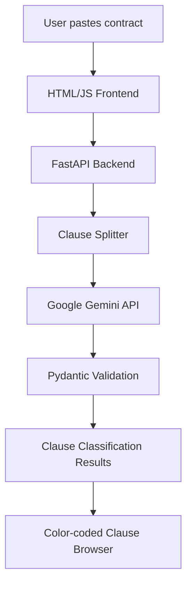

# Project 4 — Contract Clause Classifier


## 📄 Business Problem

Legal teams spend significant time reviewing contracts to identify important clauses such as obligations, liability risks, intellectual property terms, and termination conditions.

A junior legal analyst may spend several hours manually reviewing 20–80 page agreements before senior counsel can begin detailed review.

This process is expensive, repetitive, and difficult to scale.

---

# 🎯 Project Objective

Build an AI-powered contract analysis application that:

* Accepts contract text from users
* Automatically splits contracts into individual clauses
* Classifies each clause into legal categories using **Google Gemini AI**
* Provides confidence scores and reasoning
* Displays results in a simple browser interface

## Supported Categories

| Category             | Description                                           |
| -------------------- | ----------------------------------------------------- |
| Obligation           | Required actions or responsibilities of parties       |
| Risk/Liability       | Indemnity, damages, warranties, liability limitations |
| IP/Ownership         | Intellectual property rights, licensing, ownership    |
| Termination          | Agreement ending conditions and notice periods        |
| Standard Boilerplate | Governing law, notices, definitions, general terms    |

---

# 🏗 System Architecture



---

# 🛠 Tech Stack

| Layer            | Technology                      |
| ---------------- | ------------------------------- |
| LLM              | Google Gemini 2.5 Flash         |
| Backend          | FastAPI                         |
| AI Integration   | Google Generative AI SDK        |
| Frontend         | HTML + CSS + Vanilla JavaScript |
| Async Processing | asyncio + Gemini async calls    |
| Validation       | Pydantic                        |
| Testing          | Pytest                          |

---

# 📁 Project Structure

```
project-04-contract-clause-classifier/

├── backend/
│   ├── __init__.py
│   ├── main.py              # FastAPI application
│   ├── segmenter.py         # Contract clause splitting
│   ├── classifier.py        # Gemini AI classification
│   └── models.py            # Pydantic request/response models
│
├── frontend/
│   ├── index.html           # Web interface
│   ├── style.css            # UI styling
│   └── app.js               # API communication
│
├── tests/
│   └── test_segmenter.py
│
├── samples/
│   └── sample_contract.txt
│
├── .env.example
├── requirements.txt
└── README.md
```

---

# ⚙️ Setup

## 1. Clone Repository

```bash
git clone <your-repository-url>

cd project-04-contract-clause-classifier
```

---

## 2. Create Virtual Environment

Mac/Linux:

```bash
python -m venv venv

source venv/bin/activate
```

Windows:

```bash
venv\Scripts\activate
```

---

## 3. Install Dependencies

```bash
pip install -r requirements.txt
```

---

# 🔑 Environment Configuration

Create `.env` file:

```bash
cp .env.example .env
```

`.env`

```env
GOOGLE_API_KEY=your-gemini-api-key
```

---

# 🔐 Getting Gemini API Key

1. Open Google AI Studio

2. Create an API key

3. Add it to `.env`

Example:

```
GOOGLE_API_KEY=AIzaXXXXXXXXXXXXXXXX
```

---

# 📦 Dependencies

`requirements.txt`

```
google-generativeai>=0.8.0

fastapi>=0.110.0

uvicorn>=0.29.0

pydantic>=2.0.0

python-dotenv>=1.0.0

httpx>=0.27.0

pytest>=8.0.0

pytest-asyncio>=0.23.0
```

---

# 🧠 How It Works

## Step 1 — Contract Input

User pastes contract content into the browser.

Example:

```
The vendor shall maintain confidentiality
of all customer information during and after
the agreement period.
```

---

## Step 2 — Clause Segmentation

The backend identifies individual clauses.

Supported formats:

* Numbered sections
* Articles
* Sections
* Paragraph-based contracts

Example:

```
Clause 1:
Confidentiality obligations

Clause 2:
Termination rights
```

---

## Step 3 — Gemini AI Classification

Each clause is sent to Google Gemini.

Gemini returns:

```json
{
 "category":"Obligation",
 "confidence":0.94,
 "reasoning":"The clause requires the vendor to maintain confidentiality."
}
```

---

## Step 4 — Results Display

The frontend displays:

* Clause number
* Category
* Confidence score
* AI reasoning

---

# 🚀 Running the Application

## Start Backend

From project root:

```bash
uvicorn backend.main:app --reload --port 8000
```

Backend:

```
http://localhost:8000
```

API Documentation:

```
http://localhost:8000/docs
```

---

## Open Frontend

Open:

```
frontend/index.html
```

in your browser.

---

# 🧪 Testing

Run:

```bash
pytest tests/ -v
```

---

# ⚡ Performance Design

## Async Gemini Calls

Instead of processing clauses sequentially:

```
Clause 1 → Gemini
wait
Clause 2 → Gemini
wait
Clause 3 → Gemini
```

The application uses:

```
Clause 1 ┐
Clause 2 ├── Gemini Parallel Requests
Clause 3 ┘
```

Benefits:

* Faster processing
* Better user experience
* Scales for large contracts

---

# 🧩 Why Gemini Flash?

Gemini Flash is optimized for:

* Fast response time
* Lower cost
* High-volume AI workloads

Contract classification does not always require expensive reasoning models, making Flash a practical choice.

---

# 🔍 Future Improvements

## 1. PDF Upload Support

Allow users to upload:

* PDF contracts
* DOCX agreements

Extract text automatically.

---

## 2. RAG Legal Knowledge Base

Add company legal documents:

```
Contract
    |
    |
Vector Database
    |
    |
Relevant Legal Policies
    |
    |
Gemini Response
```

---

## 3. Risk Detection

Automatically highlight:

* High-risk clauses
* Missing protections
* Unusual contract terms

---

## 4. Contract Comparison

Compare:

```
Old Contract
      |
      |
AI Diff Analysis
      |
      |
New Contract
```

---

# 🎤 Interview Discussion Points

## 1. Why Gemini Flash?

Fast classification with lower cost for batch workloads.

---

## 2. Why async processing?

Contracts contain many clauses. Parallel processing reduces total latency.

---

## 3. How would you improve accuracy?

Possible improvements:

* Fine-tuned models
* Legal RAG system
* Human feedback loop
* Better prompt evaluation

---

## 4. How would you scale this?

Architecture:

```
Frontend

↓

FastAPI

↓

Queue System
(Celery / PubSub)

↓

Gemini API Workers

↓

Database

↓

Results Dashboard
```

---

# 📊 Evaluation

| Feature           | Implementation   |
| ----------------- | ---------------- |
| AI Classification | ✅ Gemini API     |
| Backend API       | ✅ FastAPI        |
| Frontend UI       | ✅ HTML/JS        |
| Async Processing  | ✅ asyncio        |
| Data Validation   | ✅ Pydantic       |
| Automated Tests   | ✅ Pytest         |
| Legal Categories  | ✅ 5 clause types |

---

# ⭐ Portfolio Value

This project demonstrates:

* Generative AI integration
* Prompt engineering
* LLM structured output handling
* Async AI workflows
* Full-stack AI application development
* Enterprise document automation

---

# 📌 Author

Ashok Mamidi

AI Engineer Portfolio Projects
