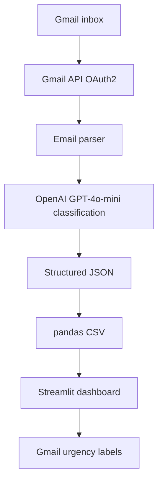

# Project 7 — Customer Refund Request Classifier


## Business Problem
E-commerce support teams receive thousands of refund and return requests weekly. Manual triage
accounts for 30-40% of handle time. At scale (2,000 emails/day at $0.05/min agent cost) a 60s
reduction in triage time per email saves ~$1,700/day.

## Project Objective
Python automation that reads Gmail → classifies by type + urgency → exports sorted CSV →
applies Gmail labels → shows Streamlit dashboard.

## System Architecture


## Folder Structure
```
project-7-customer-refund-request-classifier/
├── src/
│   ├── gmail_client.py
│   ├── classifier.py
│   └── dashboard.py
├── tests/
│   └── test_classifier.py
├── samples/
│   └── sample_emails.json
├── output/
├── .env.example
├── requirements.txt
└── README.md
```

## Setup
```bash
# 1. Google Cloud Console → Enable Gmail API → Download credentials.json
# 2. Place credentials.json in project root
pip install -r requirements.txt && cp .env.example .env
python src/classifier.py        # First run opens browser for OAuth
streamlit run src/dashboard.py
```

## Step-by-Step Implementation Guide

This guide walks you through building this project from scratch. Follow each step in order.

---

### Step 1: Project Setup

**1.1 — Create your project folder and virtual environment**

```bash
mkdir project-07-customer-refund-request-classifier
cd project-07-customer-refund-request-classifier
python -m venv venv
source venv/bin/activate          # Mac/Linux
venv\Scripts\activate             # Windows
```

A virtual environment keeps your project's dependencies isolated from other Python projects on your machine. Always activate it before working.

**1.2 — Create the folder structure**

```bash
mkdir src tests samples output
touch src/classifier.py src/gmail_client.py src/dashboard.py
touch tests/test_classifier.py
touch requirements.txt .env.example .env README.md
```

**1.3 — Install dependencies**

Add this to `requirements.txt`:

```
openai>=1.30.0
google-auth>=2.29.0
google-auth-oauthlib>=1.2.0
google-api-python-client>=2.125.0
pandas>=2.0.0
streamlit>=1.35.0
python-dotenv>=1.0.0
pytest>=8.0.0
```

Then install:

```bash
pip install -r requirements.txt
```

**1.4 — Configure environment variables**

Add this to `.env.example`:
```
OPENAI_API_KEY=sk-your-key-here
```

Copy it to `.env` and fill in your real key:
```bash
cp .env.example .env
```

- **OPENAI_API_KEY** → Go to [platform.openai.com](https://platform.openai.com), sign up, go to API Keys, create a new key.

**1.5 — Set up Gmail API credentials**

This project reads real emails from Gmail, so it needs special Google permission:

1. Go to [console.cloud.google.com](https://console.cloud.google.com)
2. Create a new project (e.g. "RefundClassifier")
3. Go to **APIs & Services → Library**, search for **Gmail API**, click Enable
4. Go to **APIs & Services → OAuth Consent Screen** → choose External → fill in app name
5. Go to **APIs & Services → Credentials → Create Credentials → OAuth 2.0 Client ID**
6. Application type: **Desktop App** → create
7. Download the JSON file, rename it to `credentials.json`, place it in your project root

> `credentials.json` contains secrets — never commit it to GitHub. Add it to `.gitignore`.

---

### Step 2: Understand the Folder Structure

```
project-07-customer-refund-request-classifier/
├── src/
│   ├── gmail_client.py    ← handles Gmail login and fetching emails
│   ├── classifier.py      ← sends emails to OpenAI, gets structured results, saves CSV
│   └── dashboard.py       ← Streamlit UI to view and filter results
├── tests/
│   └── test_classifier.py ← automated tests for the classifier logic
├── samples/
│   └── sample_emails.json ← fake email data for testing without Gmail
├── output/                ← CSV files saved after each run
├── .env.example           ← template for environment variables
├── requirements.txt       ← Python packages needed
└── README.md
```

**Why separate files?** Each file has one job. `gmail_client.py` only deals with Google authentication and fetching emails. `classifier.py` only deals with AI classification. `dashboard.py` only deals with the UI. This makes it easy to change one part without breaking others.

---

### Step 3: Build the Gmail Client (`src/gmail_client.py`)

This file handles logging into Gmail and fetching unread emails.

```python
"""gmail_client.py — Gmail OAuth2 and email fetching"""
import base64, os
from google.oauth2.credentials import Credentials
from google_auth_oauthlib.flow import InstalledAppFlow
from google.auth.transport.requests import Request
from googleapiclient.discovery import build

# This scope allows reading AND modifying emails (needed to apply labels)
SCOPES = ["https://www.googleapis.com/auth/gmail.modify"]
```

**Why `gmail.modify` and not just `gmail.readonly`?** Because we want to apply urgency labels to classified emails later. `readonly` would prevent that.

```python
def get_service():
    creds = None
    # Check if we already have a saved token from a previous login
    if os.path.exists("token.json"):
        creds = Credentials.from_authorized_user_file("token.json", SCOPES)

    # If no valid credentials, start the OAuth flow
    if not creds or not creds.valid:
        if creds and creds.expired and creds.refresh_token:
            creds.refresh(Request())      # Silently refresh expired token
        else:
            # Opens browser for user to log in to Google
            flow = InstalledAppFlow.from_client_secrets_file("credentials.json", SCOPES)
            creds = flow.run_local_server(port=0)

        # Save token so next run doesn't need browser login
        with open("token.json", "w") as f:
            f.write(creds.to_json())

    return build("gmail", "v1", credentials=creds)
```

**What is OAuth2?** It's the standard way to let your app access a user's Google account without storing their password. The first time you run this, it opens a browser window asking you to approve access. After that, it saves a `token.json` file so it doesn't need to ask again.

```python
def fetch_unread_emails(service, label="INBOX", max_results=50):
    # Search Gmail for unread messages in the inbox
    results = service.users().messages().list(
        userId="me", q=f"is:unread label:{label}", maxResults=max_results
    ).execute()

    emails = []
    for msg in results.get("messages", []):
        # Fetch full details of each message
        full = service.users().messages().get(
            userId="me", id=msg["id"], format="full"
        ).execute()

        # Extract headers (From, Subject, Date)
        headers = {h["name"]: h["value"] for h in full["payload"]["headers"]}
        body = _extract_body(full["payload"])

        emails.append({
            "id": msg["id"],
            "from": headers.get("From", ""),
            "subject": headers.get("Subject", ""),
            "received_at": headers.get("Date", ""),
            "body": body[:1000]      # Limit to 1000 chars to control token usage
        })
    return emails
```

**Why limit body to 1000 chars?** GPT charges per token (roughly per word). A full email thread could be thousands of tokens. For classification we only need the first part of the email — the key information is almost always at the top.

```python
def _extract_body(payload):
    # Simple emails have body directly in payload
    if payload.get("body", {}).get("data"):
        return base64.urlsafe_b64decode(
            payload["body"]["data"]
        ).decode("utf-8", errors="ignore")

    # Multipart emails (with attachments, HTML + plain text) have nested parts
    for part in payload.get("parts", []):
        if part["mimeType"] == "text/plain" and part.get("body", {}).get("data"):
            return base64.urlsafe_b64decode(
                part["body"]["data"]
            ).decode("utf-8", errors="ignore")
    return ""
```

**Why `urlsafe_b64decode`?** Gmail encodes email bodies in Base64 (URL-safe variant) to safely transmit any character. We have to decode it to get readable text.

```python
def apply_label(service, message_id, label_name):
    # Get all existing labels in the mailbox
    labels = service.users().labels().list(userId="me").execute().get("labels", [])
    label_map = {l["name"]: l["id"] for l in labels}

    # Create the label if it doesn't exist yet
    if label_name not in label_map:
        new = service.users().labels().create(
            userId="me",
            body={"name": label_name, "labelListVisibility": "labelShow",
                  "messageListVisibility": "show"}
        ).execute()
        label_id = new["id"]
    else:
        label_id = label_map[label_name]

    # Apply the label to the email
    service.users().messages().modify(
        userId="me", id=message_id,
        body={"addLabelIds": [label_id]}
    ).execute()
```

---

### Step 4: Build the Classifier (`src/classifier.py`)

This file sends each email to GPT and gets back structured classification data.

```python
"""classifier.py — OpenAI classification + CSV export"""
import json, os
from datetime import datetime
import pandas as pd
from openai import OpenAI
from dotenv import load_dotenv

load_dotenv()
client = OpenAI(api_key=os.getenv("OPENAI_API_KEY"))
```

**The system prompt** — this is the most important part. It defines exactly what fields you want back and the rules for each:

```python
SYSTEM_PROMPT = """You are a customer support triage specialist.
Return ONLY valid JSON:
{"request_type":"Refund"|"Return"|"Exchange"|"Complaint"|"Other",
 "urgency":"critical"|"high"|"medium"|"low",
 "one_line_summary":"max 15 words",
 "suggested_action":"issue_refund"|"process_return"|"send_replacement"|"escalate_to_manager"|"standard_reply"|"flag_for_review",
 "chargeback_risk":true|false}

Urgency: critical=chargeback/legal/review threat, high=not received>14d or wrong item,
medium=standard request, low=general query"""
```

**Why define all options explicitly?** If you just say "rate the urgency", GPT might return "URGENT" one time and "Very High" another time. By listing the exact allowed values, you get consistent, machine-readable results every time.

```python
def classify_email(from_addr, subject, body):
    # Combine all email info into one string for the model
    content = f"From: {from_addr}\nSubject: {subject}\n\n{body}"

    resp = client.chat.completions.create(
        model="gpt-4o-mini",
        response_format={"type": "json_object"},  # Forces valid JSON output
        messages=[
            {"role": "system", "content": SYSTEM_PROMPT},
            {"role": "user", "content": content}
        ],
        temperature=0.1  # Very low = very consistent, less creative
    )
    return json.loads(resp.choices[0].message.content)
```

**Why `temperature=0.1`?** Temperature controls randomness. For classification tasks you want the model to be highly consistent — the same email should always get the same classification. Low temperature achieves this.

```python
def classify_batch(emails):
    results = []
    for email in emails:
        try:
            classification = classify_email(email["from"], email["subject"], email["body"])
            # Merge original email fields with AI classification fields
            results.append({**email, **classification})
        except Exception as e:
            # If one email fails, record the error and continue — don't crash the whole batch
            results.append({**email, "request_type": None, "urgency": None,
                            "one_line_summary": f"Error: {e}",
                            "suggested_action": None, "chargeback_risk": None})

    df = pd.DataFrame(results)

    # Sort by urgency so critical emails appear first
    urgency_order = pd.CategoricalDtype(["critical", "high", "medium", "low"], ordered=True)
    if "urgency" in df.columns:
        df["urgency"] = df["urgency"].astype(urgency_order)
        df = df.sort_values("urgency")

    # Save to output folder with timestamp in filename
    os.makedirs("output", exist_ok=True)
    path = f"output/classified_{datetime.now().strftime('%Y%m%d_%H%M%S')}.csv"
    df.to_csv(path, index=False)
    print(f"Saved: {path}")
    return df
```

**Why catch exceptions per email?** If you're processing 50 emails and one has a weird encoding or the API times out, you don't want the whole run to crash. Catching the error per email means 49 others still get processed.

---

### Step 5: Build the Dashboard (`src/dashboard.py`)

```python
"""dashboard.py — Streamlit support queue"""
import os, glob
import pandas as pd
import streamlit as st

st.set_page_config(page_title="Support Queue", page_icon="📧", layout="wide")
st.title("📧 Customer Support Queue Dashboard")
```

**Load the latest CSV output:**

```python
# Find all CSV files in the output folder, sorted newest first
csv_files = sorted(glob.glob("output/*.csv"), reverse=True)

if not csv_files:
    # Fall back to sample data if no real run has happened yet
    sample = "samples/sample_classified_output.csv"
    if os.path.exists(sample):
        df = pd.read_csv(sample)
        st.caption("Showing sample data — run classifier.py to load live data")
    else:
        st.warning("No data found. Run src/classifier.py first.")
        st.stop()   # st.stop() halts execution — nothing below this runs
else:
    df = pd.read_csv(csv_files[0])   # Load only the most recent file
    st.caption(f"Latest run: `{csv_files[0]}`")
```

**Show urgency summary metrics:**

```python
# 4 columns side by side — one per urgency level
cols = st.columns(4)
for col, level, icon in zip(cols, ["critical", "high", "medium", "low"], ["🔴", "🟠", "🟡", "🟢"]):
    count = int((df.get("urgency", "") == level).sum()) if "urgency" in df.columns else 0
    col.metric(f"{icon} {level.capitalize()}", count)
```

**Filter and display:**

```python
# Optional filter for chargeback risk
if st.checkbox("Show chargeback risk only") and "chargeback_risk" in df.columns:
    df = df[df["chargeback_risk"] == True]

# Show the dataframe as an interactive table
st.dataframe(df, use_container_width=True)

# Let support agents download the filtered view
st.download_button("Download CSV", df.to_csv(index=False), "queue.csv", "text/csv")
```

---

### Step 6: Run and Test

**Option A — With real Gmail (full flow):**

```bash
# First run — opens browser for Google login
python src/classifier.py

# Then open the dashboard
streamlit run src/dashboard.py
```

When you run `classifier.py` for the first time, a browser window opens asking you to log in to Google and grant the app access to Gmail. After you approve, it saves `token.json` and won't ask again.

**Option B — With sample data (no Gmail needed):**

Create `samples/sample_emails.json` with test emails:
```json
[
  {
    "id": "test001",
    "from": "angry.customer@example.com",
    "subject": "URGENT - I want to file a chargeback!!!",
    "received_at": "2024-01-15",
    "body": "I ordered 3 weeks ago and still nothing. This is unacceptable. If I don't get a refund in 24 hours I am calling my bank."
  }
]
```

Then modify `classifier.py` to load from this file instead of calling Gmail:
```python
import json
with open("samples/sample_emails.json") as f:
    emails = json.load(f)
df = classify_batch(emails)
print(df[["subject", "urgency", "suggested_action"]].to_string())
```

**Run tests:**
```bash
pytest tests/test_classifier.py -v
```

---

### Step 7: Troubleshooting

| Error | Cause | Fix |
|---|---|---|
| `FileNotFoundError: credentials.json` | Missing Google OAuth file | Download from Google Cloud Console, place in project root |
| `403 access_denied` in browser | App not verified by Google | In OAuth Consent Screen, add your own Gmail as a test user |
| `openai.AuthenticationError` | Wrong or missing API key | Check your `.env` file has `OPENAI_API_KEY=sk-...` |
| `token.json` causes login errors | Stale token | Delete `token.json` and re-run — it will re-authenticate |
| `ModuleNotFoundError` | Package not installed | Run `pip install -r requirements.txt` with venv active |
| Dashboard shows "No data found" | Haven't run classifier yet | Run `python src/classifier.py` first |
| Gmail API quota exceeded | Too many requests | Google free tier: 1 billion units/day. Unlikely to hit this. |

---

## Time Estimate
| Mode | Time |
|---|---|
| Self-paced | 12–16 hours |
| Instructor-guided | 6–9 hours |

## Bonus Extensions
- Auto-draft Gmail replies for low-urgency emails
- Slack webhook alert for critical emails
- Public Streamlit dashboard with sample CSV pre-loaded (mandatory deployment)
