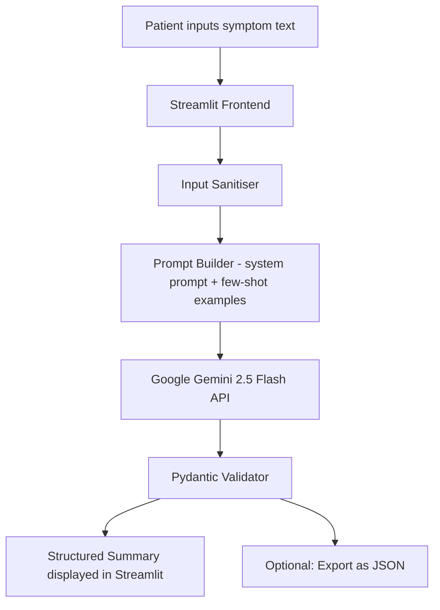

# 🏥 Project 1 — Medical Symptom Summarizer


## 🧩 Business Problem
Hospital intake teams receive patient symptom descriptions in messy, unstructured formats — phone transcripts, portal messages, nurse notes. Clinicians must manually parse them before acting, adding friction when speed matters most. In busy emergency departments this parsing overhead contributes to longer wait times and missed information.

## 🎯 Project Objective
Build a Streamlit web app that accepts a raw patient symptom description and uses Google Gemini to transform it into a structured clinical summary including:
- Chief complaint
- Symptom onset & duration
- Severity (1–10)
- Red flags
- Triage urgency (low / moderate / high)

> ⚠️ This tool does **not** diagnose. It summarises and structures — clinical judgment stays with the professional.

## 🏗 System Architecture



## 🛠 Tech Stack
| Layer | Tool |
|---|---|
| LLM | Google Gemini 2.5 Flash |
| Frontend | Streamlit |
| Validation | Pydantic |
| Language | Python 3.10+ |

## 📁 Folder Structure
```
medical-symptom-summarizer/
├── app/
│   ├── streamlit_app.py       # Main Streamlit UI
│   ├── prompt_builder.py      # System prompt + few-shot construction
│   └── validator.py           # Pydantic output schema
├── tests/
│   └── test_prompts.py        # 10 test cases
├── samples/
│   └── sample_symptoms.json   # 5 fictional symptom descriptions
├── .env.example
├── requirements.txt
└── README.md
```

## ⚙️ Setup

```bash
git clone <your-repo-url>
cd medical-symptom-summarizer
python3 -m venv venv && source venv/bin/activate
pip install -r requirements.txt
cp .env.example .env          # Add your GOOGLE_API_KEY
streamlit run app/streamlit_app.py
```

## 🚀 Usage
1. Paste or type a patient symptom description
2. Click **Summarise**
3. View the structured output with colour-coded triage badge
4. Export as JSON if needed

## Step-by-Step Implementation Guide

This guide walks you through building this project from scratch. Follow each step in order.

---

### Step 1: Project Setup

**1.1 — Create your project folder and virtual environment**

```bash
mkdir medical-symptom-summarizer
cd medical-symptom-summarizer
python3 -m venv venv
source venv/bin/activate          # Mac/Linux
venv\Scripts\activate             # Windows
```

A virtual environment keeps this project's packages isolated. Always activate it before working.

**1.2 — Create the folder structure**

```bash
mkdir app tests samples
touch app/streamlit_app.py app/prompt_builder.py app/validator.py
touch tests/test_prompts.py
touch requirements.txt .env.example .env
```

**1.3 — Install dependencies**

Add to `requirements.txt`:
```
google-generativeai>=0.7.0
streamlit>=1.35.0
pydantic>=2.0.0
python-dotenv>=1.0.0
pytest>=8.0.0
```

Then install:
```bash
pip install -r requirements.txt
```

**1.4 — Configure your API key**

`.env.example`:
```
GOOGLE_API_KEY=your-google-api-key-here
```

```bash
cp .env.example .env
```

Get your **GOOGLE_API_KEY** → go to [aistudio.google.com/apikey](https://aistudio.google.com/app/apikey) → sign in with Google → Create API key → paste into `.env`.

---

### Step 2: Understand the Folder Structure

```
medical-symptom-summarizer/
├── app/
│   ├── streamlit_app.py   ← the web UI — what the user sees and interacts with
│   ├── prompt_builder.py  ← builds the exact text sent to Gemini (the system prompt + user message)
│   └── validator.py       ← Pydantic schema that validates Gemini's JSON response
├── tests/
│   └── test_prompts.py    ← automated tests to verify your prompt + validator logic
├── samples/
│   └── sample_symptoms.json  ← example symptom descriptions for testing
├── .env.example
├── requirements.txt
└── README.md
```

**Why three separate files for the app?** Each has one job:
- `prompt_builder.py` — if your summaries aren't accurate, you edit this file
- `validator.py` — if the output structure changes, you edit this file
- `streamlit_app.py` — if the UI needs changes, you edit this file

This separation means you never have to search through one giant file to find what to change.

---

### Step 3: Build the Prompt (`app/prompt_builder.py`)

The system prompt is the most critical piece — it defines what Gemini does and what format it returns.

```python
"""prompt_builder.py — builds prompts for symptom summarisation"""

SYSTEM_PROMPT = """
You are a clinical intake assistant. Your job is to convert unstructured patient
symptom descriptions into a structured JSON summary for nursing staff.

OUTPUT FORMAT — return ONLY valid JSON matching this schema exactly:
{
  "chief_complaint": "string — one sentence describing the main issue",
  "onset": "string — when symptoms started",
  "duration": "string — how long symptoms have been present",
  "severity": integer between 1 and 10 (null if not mentioned),
  "red_flags": ["list", "of", "concerning", "symptoms"],
  "triage_level": "low" | "moderate" | "high"
}

TRIAGE RULES:
- high   → any red flag present (chest pain, difficulty breathing, loss of
            consciousness, severe bleeding, sudden severe headache, stroke symptoms)
- moderate → significant pain (≥6/10), worsening symptoms, or symptoms >72 hours
- low    → mild symptoms, improving, or routine query

CRITICAL RULES:
- Never add diagnostic language (do not say "this sounds like X disease")
- If a field is not mentioned, return null — never guess
- Return ONLY the JSON object — no markdown, no explanation
```

**Why such detailed triage rules?** Without explicit rules, Gemini would use its own judgment on what "high" means — which would be inconsistent. By giving exact criteria, every similar input gets the same triage level. This is called **prompt engineering** — reducing ambiguity to improve consistency.

**Why "Never add diagnostic language"?** This is a legal and ethical guard. The tool summarises — it does not diagnose. Without this rule, Gemini might say "this sounds like appendicitis" which could be harmful if wrong.

**Few-shot examples** — add these to the end of `SYSTEM_PROMPT` to show Gemini the expected format with real examples:

```python
SYSTEM_PROMPT += """
FEW-SHOT EXAMPLES:

Input: "I have had a headache for 3 days, it's about a 6/10, took paracetamol but it didn't help."
Output:
{
  "chief_complaint": "Persistent headache unresponsive to paracetamol",
  "onset": "3 days ago",
  "duration": "3 days",
  "severity": 6,
  "red_flags": [],
  "triage_level": "moderate"
}

Input: "chest pain started an hour ago, really bad, left arm feels weird"
Output:
{
  "chief_complaint": "Acute chest pain with left arm radiation",
  "onset": "1 hour ago",
  "duration": "Acute onset",
  "severity": null,
  "red_flags": ["chest pain", "left arm radiation"],
  "triage_level": "high"
}
"""
```

**Why include examples in the prompt?** This is called **few-shot prompting**. Showing Gemini 2-3 example inputs and correct outputs dramatically improves the quality of the real outputs — especially for edge cases and formatting.

```python
def build_user_message(symptom_text: str) -> str:
    """Wrap the patient's text in a clearly labelled user message."""
    return f"Patient description:\n{symptom_text.strip()}"
```

**Why wrap it in a function?** Even a simple operation like this is worth a function — it makes the calling code cleaner, and if you later want to add preprocessing (e.g., strip personally identifiable info), you change one place.

---

### Step 4: Build the Validator (`app/validator.py`)

The validator defines the exact shape of the data you expect from Gemini and rejects anything that doesn't match.

```python
"""validator.py — Pydantic schema for Gemini output validation"""
from __future__ import annotations
from typing import List, Literal, Optional
from pydantic import BaseModel, field_validator
```

**What is Pydantic?** Pydantic is a Python library that validates data against a schema automatically. When you define `severity: Optional[int]`, Pydantic ensures it's either an integer or None — never a string like "seven".

```python
class SymptomSummary(BaseModel):
    chief_complaint: str                           # Required — must always be present
    onset: Optional[str] = None                   # Optional — null if not mentioned
    duration: Optional[str] = None
    severity: Optional[int] = None                # Integer or null
    red_flags: List[str] = []                     # List of strings (can be empty)
    triage_level: Literal["low", "moderate", "high"]   # Must be one of these 3 values

    @field_validator("severity")
    @classmethod
    def severity_range(cls, v):
        """Custom validation: if severity is given, it must be 1-10."""
        if v is not None and not (1 <= v <= 10):
            raise ValueError("Severity must be between 1 and 10")
        return v


def validate_response(raw: dict) -> SymptomSummary:
    """Parse and validate the LLM JSON response. Raises ValidationError if invalid."""
    return SymptomSummary(**raw)
```

**Why `Literal["low", "moderate", "high"]`?** If you just use `str`, Gemini could return "High", "HIGH", "elevated", "serious" — any word. `Literal` restricts it to exactly those three values. Pydantic will raise an error if Gemini returns anything else, so you can catch it and retry.

**Why `Optional[str] = None`?** The `Optional` means the field can be `None`. The `= None` sets the default, so if Gemini omits the field entirely, Pydantic doesn't crash — it just uses `None`.

---

### Step 5: Build the Streamlit App (`app/streamlit_app.py`)

```python
"""streamlit_app.py — main UI"""
import json, time, os
import streamlit as st
import google.generativeai as genai
from dotenv import load_dotenv
from prompt_builder import SYSTEM_PROMPT, build_user_message
from validator import validate_response, SymptomSummary
from pydantic import ValidationError

load_dotenv()
genai.configure(api_key=os.getenv("GOOGLE_API_KEY"))
model = genai.GenerativeModel(
    model_name="gemini-2.5-flash",
    system_instruction=SYSTEM_PROMPT,
)

# Colour scheme for each triage level — icon, background colour, text colour
TRIAGE_COLOURS = {
    "low":      ("🟢", "#d4edda", "#155724"),
    "moderate": ("🟡", "#fff3cd", "#856404"),
    "high":     ("🔴", "#f8d7da", "#721c24"),
}

MAX_RETRIES = 3
```

**The API call function with retry logic:**

```python
def call_api(symptom_text: str) -> SymptomSummary:
    """Call Gemini with automatic retry on failure."""
    user_msg = build_user_message(symptom_text)

    for attempt in range(MAX_RETRIES):
        try:
            response = model.generate_content(user_msg)
            # Clean response - remove markdown code fences if present
            raw_text = response.text.strip()
            if raw_text.startswith("```"):
                raw_text = raw_text.split("\n", 1)[1]
                raw_text = raw_text.rsplit("```", 1)[0]
            raw = json.loads(raw_text)
            return validate_response(raw)

        except ValidationError as e:
            if attempt == MAX_RETRIES - 1:
                raise    # Give up after 3 tries
            time.sleep(2 ** attempt)   # Wait 1s, 2s, 4s between retries

        except Exception as e:
            if attempt == MAX_RETRIES - 1:
                raise
            time.sleep(2 ** attempt)
```

**Why strip markdown code fences?** Unlike OpenAI's JSON mode, Gemini sometimes wraps its JSON response in ` ```json ... ``` ` markdown blocks. The cleanup code removes those before parsing.

**Why `2 ** attempt` for retry delay?** This is **exponential backoff** — a standard technique. If the first call fails, wait 1 second. If the second fails, wait 2 seconds. If the third fails, wait 4. This gives the API time to recover if it's overloaded.

**Build the UI layout:**

```python
st.set_page_config(page_title="Medical Symptom Summarizer", page_icon="🏥", layout="wide")
st.title("🏥 Medical Symptom Summarizer")

# Important disclaimer — always shown at the top
st.warning(
    "⚠️ **Disclaimer:** This tool does not provide medical advice or diagnosis. "
    "All outputs require clinical judgment by a qualified professional."
)

# Two-column layout: input on left, output on right
col_input, col_output = st.columns([1, 1], gap="large")

with col_input:
    st.subheader("Patient Symptom Description")
    symptom_text = st.text_area(
        label="Paste or type the patient's description",
        height=250,
        placeholder="e.g. I've had a severe headache for 2 days, pain is 8/10...",
    )
    submitted = st.button("🔍 Summarise", type="primary", use_container_width=True)

    # Keep a session history of the last 5 summaries
    if "history" not in st.session_state:
        st.session_state.history = []

    if st.session_state.history:
        st.markdown("---")
        st.caption("Recent summaries (this session)")
        for item in reversed(st.session_state.history[-5:]):
            st.caption(f"• {item['chief_complaint']} — **{item['triage_level'].upper()}**")
```

**What is `st.session_state`?** Every time the user interacts with anything in Streamlit, the entire script reruns. `session_state` is a dictionary that persists between reruns — the only way to "remember" something across interactions.

**Display the results:**

```python
with col_output:
    st.subheader("Structured Summary")

    if submitted:
        if not symptom_text.strip():
            st.error("Please enter a symptom description.")
        elif len(symptom_text.strip().split()) < 5:
            st.warning("Description is very short. Please provide more detail.")
        else:
            with st.spinner("Analysing symptoms..."):
                try:
                    result = call_api(symptom_text)

                    # Render triage badge with colour
                    icon, bg, fg = TRIAGE_COLOURS[result.triage_level]
                    st.markdown(
                        f"""<div style='background:{bg};color:{fg};padding:12px 18px;
                        border-radius:8px;font-weight:bold;font-size:1.1rem;margin-bottom:16px'>
                        {icon} Triage Level: {result.triage_level.upper()}</div>""",
                        unsafe_allow_html=True,
                    )

                    # Display each field
                    st.markdown(f"**Chief Complaint:** {result.chief_complaint}")
                    st.markdown(f"**Onset:** {result.onset or 'Not mentioned'}")
                    st.markdown(f"**Duration:** {result.duration or 'Not mentioned'}")
                    st.markdown(f"**Severity:** {result.severity or 'Not mentioned'}/10")

                    if result.red_flags:
                        st.markdown("**🚨 Red Flags:**")
                        for flag in result.red_flags:
                            st.markdown(f"- {flag}")
                    else:
                        st.markdown("**Red Flags:** None identified")

                    # JSON export button
                    st.download_button(
                        label="⬇ Export as JSON",
                        data=result.model_dump_json(indent=2),
                        file_name="symptom_summary.json",
                        mime="application/json",
                    )

                    # Add to session history
                    st.session_state.history.append(result.model_dump())

                except ValidationError as e:
                    st.error(f"Output validation failed: {e}")
                except Exception as e:
                    st.error(f"Something went wrong: {e}")
```

---

### Step 6: Run and Test

```bash
# From the project root
streamlit run app/streamlit_app.py
```

Your browser will open automatically at `http://localhost:8501`.

**Test cases to try:**

| Input | Expected triage |
|---|---|
| "I have a mild headache, started this morning, took paracetamol and it helped" | low |
| "Headache for 4 days, 7/10 pain, not getting better" | moderate |
| "Chest pain, started 30 minutes ago, pain goes to my left arm, sweating" | high |
| "I feel a bit tired today" | low |

**Run automated tests:**
```bash
pytest tests/test_prompts.py -v
```

---

### Step 7: Troubleshooting

| Error | Cause | Fix |
|---|---|---|
| `google.api_core.exceptions.InvalidArgument` | Invalid API key | Check your `.env` file has the correct `GOOGLE_API_KEY` |
| `ValidationError: triage_level` | Gemini returned unexpected value | Check your system prompt — the triage rules may need to be clearer |
| `json.JSONDecodeError` | Gemini returned non-JSON | The code strips markdown fences; if still failing, check the prompt |
| `ModuleNotFoundError: prompt_builder` | Running from wrong directory | Run `streamlit run app/streamlit_app.py` from the project root |
| Streamlit port already in use | Another Streamlit instance running | Use `streamlit run app/streamlit_app.py --server.port 8502` |
| Results disappear on button click | Not using `session_state` | Store results in `st.session_state` as shown above |
| 429 Rate limit error | Too many requests | Wait a minute and try again (free tier has limits) |

---

## 📊 Evaluation Rubric
| Criteria | Meets | Exceeds |
|---|---|---|
| Functionality | Core summariser works end-to-end | Edge cases handled, batch CSV mode |
| Code Quality | Clean, readable, commented | Modular, tested with pytest |
| Architecture | Components connected | Pydantic validation + retry logic |
| Documentation | README complete | Demo GIF + live URL included |
| Business Framing | Problem stated | Impact quantified (time saved) |

## 🎤 Interview Talking Points
1. Why structured JSON output over plain text prompting?
2. How do you prevent triage hallucination?
3. How would you scale to 10,000 notes/day?
4. What broke during development and how did you fix it?
5. What would you build next?

## ⏱ Time Estimate
| Mode | Time |
|---|---|
| Self-paced | 12–15 hours |
| Instructor-guided | 6–8 hours |

## 🚀 Bonus Extensions
- SOAP note generator from the structured summary
- Google Sheets logging backend
- Deploy with password protection + usage logging (live demo requirement)
# Medical-symptom-summarizer
