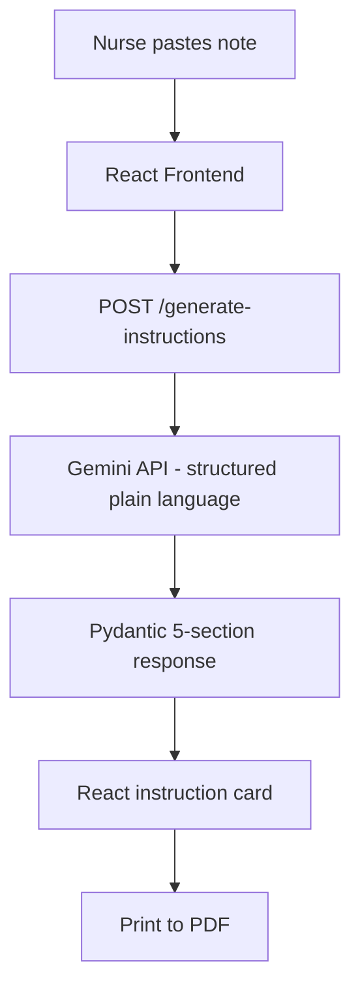

# Project 6 — Patient Discharge Instruction Generator


## Business Problem
40-80% of medical information given at discharge is forgotten immediately. Clinical notes are
written in shorthand inaccessible to most patients, leading to medication errors, missed
follow-ups, and preventable readmissions.

## Project Objective
React frontend + FastAPI backend converting clinical discharge notes into plain-language
patient instructions at a configurable reading level (5th grade / 8th grade / adult).

**Output sections:** What happened · Medications · Home care · Warning signs · Follow-up

## System Architecture


## Folder Structure
```text
project-6-patient-discharge-instruction-generator/
├── backend/
│   ├── main.py
│   ├── generator.py
│   └── models.py
├── frontend/
│   ├── src/
│   │   ├── App.jsx
│   │   └── components/
│   │       ├── InputForm.jsx
│   │       └── InstructionCard.jsx
│   ├── package.json
│   └── vite.config.js
├── tests/
│   └── test_models.py
├── samples/
│   └── sample_discharge_notes.json
├── .env.example
├── requirements.txt
└── README.md
```

## Setup
```bash
# Backend
pip install -r requirements.txt && cp .env.example .env
uvicorn backend.main:app --reload --port 8000

# Frontend
cd frontend && npm install && npm run dev
```

## Step-by-Step Implementation Guide

This guide walks you through building this project from scratch. Follow each step in order.

---

### Step 1: Project Setup

**1.1 — Create your project folder and virtual environment**

```bash
mkdir project-06-patient-discharge-instruction-generator
cd project-06-patient-discharge-instruction-generator
python -m venv venv
source venv/bin/activate   # Mac/Linux
venv\Scripts\activate      # Windows
```

**1.2 — Create the folder structure**

```bash
mkdir backend frontend/src/components tests samples
touch backend/__init__.py backend/main.py backend/generator.py backend/models.py
touch frontend/src/App.jsx frontend/src/components/InputForm.jsx frontend/src/components/InstructionCard.jsx
touch frontend/package.json frontend/vite.config.js
touch requirements.txt .env.example .env
```

> `backend/__init__.py` is required so Python treats `backend/` as a package — uvicorn needs this.

**1.3 — Install Python dependencies**

`requirements.txt`:
```text
google-generativeai>=0.4.0
fastapi>=0.110.0
uvicorn>=0.29.0
pydantic>=2.0.0
python-dotenv>=1.0.0
pytest>=8.0.0
```

```bash
pip install -r requirements.txt
```

**1.4 — Set up the React frontend**

`frontend/package.json`:
```json
{
  "name": "discharge-frontend",
  "version": "1.0.0",
  "scripts": {
    "dev": "vite",
    "build": "vite build"
  },
  "dependencies": {
    "react": "^18.2.0",
    "react-dom": "^18.2.0"
  },
  "devDependencies": {
    "@vitejs/plugin-react": "^4.0.0",
    "vite": "^5.0.0"
  }
}
```

`frontend/vite.config.js`:
```javascript
import { defineConfig } from 'vite'
import react from '@vitejs/plugin-react'
export default defineConfig({ plugins: [react()] })
```

Then install frontend dependencies:
```bash
cd frontend && npm install
```

**1.5 — Configure environment variables**

`.env.example`:
```text
GEMINI_API_KEY=your-gemini-api-key-here
```

```bash
cp .env.example .env
```

**GEMINI_API_KEY** → Go to [Google AI Studio](https://aistudio.google.com/app/apikey) → Create API key.

---

### Step 2: Understand the Folder Structure

```text
project-06-patient-discharge-instruction-generator/
├── backend/
│   ├── __init__.py    ← makes backend/ a Python package
│   ├── main.py        ← FastAPI server with one POST endpoint
│   ├── generator.py   ← calls Gemini API and parses the response
│   └── models.py      ← Pydantic schemas for request and response
├── frontend/
│   ├── package.json   ← npm configuration
│   ├── vite.config.js ← Vite build tool configuration
│   └── src/
│       ├── App.jsx                   ← root component, manages state
│       └── components/
│           ├── InputForm.jsx         ← form to enter the clinical note
│           └── InstructionCard.jsx   ← displays the generated instructions
└── requirements.txt
```

**Why React instead of Streamlit?** This project introduces a full-stack pattern — a Python API backend with a JavaScript frontend. React is how most real production web apps are built. Knowing how to connect a React frontend to a FastAPI backend is a highly employable skill.

---

### Step 3: Define Data Models (`backend/models.py`)

```python
"""models.py — Pydantic schemas"""
from typing import List, Literal, Optional
from pydantic import BaseModel

class Medication(BaseModel):
    name: str
    dose: Optional[str] = None
    frequency: Optional[str] = None
    purpose: Optional[str] = None

class GenerateRequest(BaseModel):
    note: str                                          # The clinical discharge note
    reading_level: Literal["5th grade", "8th grade", "adult"]  # Must be one of these 3
    patient_name: str = "Patient"                      # Optional — defaults to "Patient"

class InstructionResponse(BaseModel):
    what_happened: Optional[str] = None
    medications: List[Medication] = []
    home_care_instructions: List[str] = []
    warning_signs: List[str] = []
    followup: Optional[str] = None
```

**Why model `Medication` separately?** Medications have structured sub-fields (name, dose, frequency, purpose). Nesting them in their own model makes it easy to display them as a table in the frontend.

**Why `Literal["5th grade", "8th grade", "adult"]`?** This restricts the reading_level field to exactly those values. If someone sends `"simple"` or `"easy"`, FastAPI automatically returns a 422 error before your code even runs.

---

### Step 4: Build the Generator (`backend/generator.py`)

```python
"""generator.py — Gemini prompt and response parsing"""
import json, os
import google.generativeai as genai
from dotenv import load_dotenv
from backend.models import InstructionResponse, Medication

load_dotenv()
genai.configure(
    api_key=os.getenv("GEMINI_API_KEY")
)

EXAMPLES = {
    "5th grade": "You had an infection. The doctors gave you medicine to make it better.",
    "8th grade": "You were treated for a stomach infection. You received fluids and antibiotics.",
    "adult": "You presented with acute gastroenteritis and received IV fluid resuscitation.",
}
```

**Why provide examples?** Reading level is subjective. By showing Gemini one example sentence per level, you calibrate exactly what "5th grade" means in this medical context — not guessing, not approximating.

```python
def generate_instructions(note, reading_level, patient_name):
    system_instruction = f"""You are a patient education specialist.
Reading level: {reading_level}. Example: "{EXAMPLES[reading_level]}"
Patient name: {patient_name}. Use "you" and "your" throughout.

Return ONLY valid JSON:
{{"what_happened":"2-3 sentences","medications":[{{"name":"","dose":"","frequency":"","purpose":""}}],
"home_care_instructions":["4-8 items"],"warning_signs":["3-6 items"],"followup":"one sentence"}}

CRITICAL: Never invent dosages. Use "as prescribed" if missing."""

    # Using gemini-1.5-pro for nuanced medical writing and high instruction-following capability
    model = genai.GenerativeModel(
        model_name="gemini-1.5-pro",
        system_instruction=system_instruction,
        generation_config={"response_mime_type": "application/json"}
    )

    response = model.generate_content(f"Note:\n{note}")

    raw = json.loads(response.text)

    # Normalise medications — Gemini might return strings instead of dicts
    raw["medications"] = [
        Medication(**m) if isinstance(m, dict) else Medication(name=str(m))
        for m in raw.get("medications", [])
    ]

    return InstructionResponse(**raw)
```

**Why "Never invent dosages"?** This is the most critical safety rule. If the discharge note says "ibuprofen" but doesn't specify the dose, Gemini must not make one up. Making up a dose could harm a patient. `"as prescribed"` tells the patient to follow the label/pharmacist.

**Why `gemini-1.5-pro` instead of `gemini-1.5-flash`?** Plain-language medical writing requires high quality and zero hallucinations. `gemini-1.5-flash` is fast and cheap but may oversimplify clinical terms. Pro's quality is worth the extra latency for patient-facing content. We also use `response_mime_type: application/json` to guarantee a clean JSON object.

---

### Step 5: Build the FastAPI Server (`backend/main.py`)

```python
"""main.py — FastAPI server"""
from fastapi import FastAPI, HTTPException
from fastapi.middleware.cors import CORSMiddleware
from backend.models import GenerateRequest, InstructionResponse
from backend.generator import generate_instructions

app = FastAPI(title="Discharge Instruction Generator")

# CORS required so the React app (on a different port) can call this API
app.add_middleware(CORSMiddleware, allow_origins=["*"], allow_methods=["*"], allow_headers=["*"])

@app.get("/health")
def health():
    return {"status": "ok"}

@app.post("/generate-instructions", response_model=InstructionResponse)
def generate(req: GenerateRequest):
    if len(req.note.strip()) < 50:
        raise HTTPException(422, "Note too short (min 50 chars).")
    try:
        return generate_instructions(req.note, req.reading_level, req.patient_name)
    except Exception as e:
        raise HTTPException(500, str(e))
```

**Why validate minimum note length?** Very short notes (e.g. "patient discharged") don't have enough information to generate meaningful instructions. Catching this early gives a clearer error than letting Gemini return an empty or nonsensical response.

---

### Step 6: Build the React Frontend

**`frontend/src/components/InputForm.jsx`** — the form component:

```jsx
import { useState } from 'react'

export default function InputForm({ onSubmit, loading }) {
  // Local state for each form field
  const [note, setNote] = useState('')
  const [level, setLevel] = useState('8th grade')
  const [name, setName] = useState('')

  function handleSubmit(e) {
    e.preventDefault()   // Prevent browser default form submission (page reload)
    onSubmit({ note, reading_level: level, patient_name: name || 'Patient' })
  }

  return (
    <form onSubmit={handleSubmit} style={{ marginBottom: 24 }}>
      <div style={{ marginBottom: 12 }}>
        <label><b>Patient Name (optional)</b></label><br/>
        <input value={name} onChange={e => setName(e.target.value)}
          placeholder="e.g. Sarah" style={{ width: '100%', padding: 8, marginTop: 4 }}/>
      </div>
      <div style={{ marginBottom: 12 }}>
        <label><b>Reading Level</b></label><br/>
        <select value={level} onChange={e => setLevel(e.target.value)}
          style={{ padding: 8, marginTop: 4 }}>
          <option>5th grade</option>
          <option>8th grade</option>
          <option>adult</option>
        </select>
      </div>
      <div style={{ marginBottom: 12 }}>
        <label><b>Clinical Discharge Note *</b></label><br/>
        <textarea value={note} onChange={e => setNote(e.target.value)}
          rows={8} required minLength={50}
          placeholder="Paste the clinical discharge note here..."
          style={{ width: '100%', padding: 8, marginTop: 4, fontFamily: 'monospace' }}/>
      </div>
      <button type="submit" disabled={loading} style={{ padding: '10px 24px', cursor: 'pointer' }}>
        {loading ? 'Generating...' : 'Generate Instructions'}
      </button>
    </form>
  )
}
```

**What is `useState`?** React's `useState` hook creates a reactive variable. When you call `setNote(newValue)`, React automatically re-renders the component with the new value. This is how React tracks what the user types.

**`frontend/src/components/InstructionCard.jsx`** — displays the results:

```jsx
export default function InstructionCard({ data }) {
  return (
    <div style={{ border: '1px solid #dee2e6', borderRadius: 8, padding: 24 }}>
      <h2>Your Discharge Instructions</h2>

      {data.what_happened && (
        <section><h3>What Happened</h3><p>{data.what_happened}</p></section>
      )}

      {data.medications?.length > 0 && (
        <section>
          <h3>Your Medications</h3>
          <table style={{ width: '100%', borderCollapse: 'collapse' }}>
            <thead>
              <tr style={{ background: '#f8f9fa' }}>
                <th style={{ padding: 8, textAlign: 'left' }}>Medicine</th>
                <th style={{ padding: 8, textAlign: 'left' }}>Dose</th>
                <th style={{ padding: 8, textAlign: 'left' }}>When</th>
                <th style={{ padding: 8, textAlign: 'left' }}>Why</th>
              </tr>
            </thead>
            <tbody>
              {data.medications.map((m, i) => (
                <tr key={i} style={{ borderTop: '1px solid #dee2e6' }}>
                  <td style={{ padding: 8 }}>{m.name}</td>
                  <td style={{ padding: 8 }}>{m.dose || 'As prescribed'}</td>
                  <td style={{ padding: 8 }}>{m.frequency || '—'}</td>
                  <td style={{ padding: 8 }}>{m.purpose || '—'}</td>
                </tr>
              ))}
            </tbody>
          </table>
        </section>
      )}

      {data.warning_signs?.length > 0 && (
        <section style={{ background: '#fff3cd', border: '1px solid #ffc107',
          borderRadius: 6, padding: 16 }}>
          <h3>Call Us Immediately If You Have</h3>
          <ul>{data.warning_signs.map((s, i) => <li key={i}>{s}</li>)}</ul>
        </section>
      )}

      <button onClick={() => window.print()} style={{ marginTop: 16, padding: '8px 20px' }}>
        Print Instructions
      </button>
    </div>
  )
}
```

**`frontend/src/App.jsx`** — the root component that ties everything together:

```jsx
import { useState } from 'react'
import InputForm from './components/InputForm'
import InstructionCard from './components/InstructionCard'

export default function App() {
  const [data, setData] = useState(null)       // The generated instructions
  const [loading, setLoading] = useState(false)
  const [error, setError] = useState('')

  async function handleSubmit(formData) {
    setLoading(true)
    setError('')
    try {
      const res = await fetch('http://localhost:8000/generate-instructions', {
        method: 'POST',
        headers: { 'Content-Type': 'application/json' },
        body: JSON.stringify(formData),
      })
      if (!res.ok) {
        const e = await res.json()
        throw new Error(e.detail)
      }
      setData(await res.json())
    } catch(e) {
      setError(e.message)
    } finally {
      setLoading(false)
    }
  }

  return (
    <div style={{ fontFamily: 'system-ui', maxWidth: 900, margin: '0 auto', padding: 24 }}>
      <h1>Patient Discharge Instructions</h1>
      <InputForm loading="{loading}" onSubmit="{handleSubmit}"/>
      {error && <p style={{ color: 'red' }}>Error: {error}</p>}
      {data && <InstructionCard data="{data}"/>}
    </div>
  )
}
```

---

### Step 7: Run and Test

**Terminal 1 — Start the backend:**
```bash
uvicorn backend.main:app --reload --port 8000
```

Verify at: `http://localhost:8000/health` → should return `{"status":"ok"}`

**Terminal 2 — Start the frontend:**
```bash
cd frontend
npm run dev
```

Open `http://localhost:5173` in your browser.

**Test with a sample note:**
```text
Patient: John Smith, 45M
Diagnosis: Acute appendicitis, post-appendectomy day 1
Medications: Amoxicillin 500mg TID x7 days, Ibuprofen 400mg PRN pain
Instructions: Rest for 2 weeks, no heavy lifting, keep wound dry
Follow-up: Surgical clinic in 7 days
Warning: Return to ED if fever >38.5, wound redness/discharge, or severe abdominal pain
```

Select "5th grade" reading level and click Generate. Verify the output uses simple language.

---

### Step 8: Troubleshooting

| Error | Cause | Fix |
|---|---|---|
| `ModuleNotFoundError: No module named 'backend'` | Running uvicorn from wrong dir | Run from project root: `uvicorn backend.main:app --reload` |
| `ImportError` on `backend.models` | Missing `__init__.py` | Create empty `backend/__init__.py` |
| `google.api_core.exceptions.InvalidArgument` | Wrong API key | Check `GEMINI_API_KEY` in `.env` |
| React "Failed to fetch" | Backend not running or CORS | Start the backend first; verify CORS middleware is added |
| `422 Note too short` | Note has fewer than 50 chars | Paste a real clinical note — not just a few words |
| `json.JSONDecodeError` | Gemini returned non-JSON | Check the `generation_config` is enforcing `application/json` |
| `npm: command not found` | Node.js not installed | Install Node.js from [nodejs.org](https://nodejs.org) |
| Blank InstructionCard | API returned null for all fields | The note may be too vague — try a more detailed clinical note |

---

## Time Estimate
| Mode | Time |
|---|---|
| Self-paced | 14–18 hours |
| Instructor-guided | 7–10 hours |

## Bonus Extensions
- QR code linking to digital instructions
- Language translation via DeepL or Gemini
- FHIR Epic API integration
