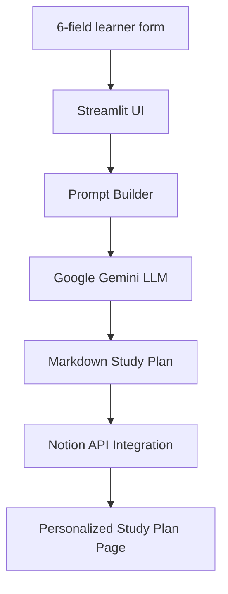

# Project 5 — Gemini-Powered Personalized Study Plan Builder


## Business Problem

Self-directed learners often struggle to create realistic and structured learning plans.

Generic learning paths do not consider:

* Current knowledge level
* Available study hours
* Target completion date
* Learning goals
* Preferred learning resources

This often leads to inconsistent progress, burnout, or abandoning learning goals.

---

## Project Objective

A Streamlit application that collects learner information and uses **Google Gemini Generative AI** to create a personalized week-by-week study plan.

The generated plan is:

1. Created using Gemini LLM
2. Structured in Markdown format
3. Previewed inside Streamlit
4. Exported as Markdown
5. Saved automatically as a Notion page using Notion API

**Inputs:**

```
Topic
Current Level
Hours per Week
Target Date
Preferred Resources
Learning Goal
```

---

## Key Features

✅ Gemini-powered personalized study plan generation
✅ Prompt engineering for structured curriculum creation
✅ Dynamic week calculation based on target date
✅ Markdown-based output formatting
✅ Streamlit interactive UI
✅ Notion API integration
✅ Export generated plans as Markdown
✅ Secure API key management using environment variables

---

## System Architecture



---

## Technology Stack

| Technology         | Purpose                          |
| ------------------ | -------------------------------- |
| Google Gemini      | AI-powered study plan generation |
| Streamlit          | Web application interface        |
| Python             | Application development          |
| Notion API         | Saving generated study plans     |
| Prompt Engineering | Structured LLM responses         |
| python-dotenv      | Environment configuration        |

---

# Folder Structure

```
project-05-personalized-study-plan-builder/

├── app/
│   ├── app.py
│   ├── prompt_builder.py
│   └── notion_writer.py
│
├── tests/
│   └── test_prompt_builder.py
│
├── samples/
│   └── sample_plan_python.md
│
├── .env.example
├── requirements.txt
└── README.md
```

---

# Setup

## 1. Clone Repository

```bash
git clone <repository-url>

cd project-05-personalized-study-plan-builder
```

---

## 2. Create Virtual Environment

### macOS / Linux

```bash
python3 -m venv venv

source venv/bin/activate
```

### Windows

```bash
venv\Scripts\activate
```

---

## 3. Install Dependencies

Create `requirements.txt`:

```
google-generativeai>=0.8.0
streamlit>=1.35.0
notion-client>=2.2.0
python-dotenv>=1.0.0
pytest>=8.0.0
```

Install:

```bash
pip install -r requirements.txt
```

---

# Environment Configuration

Create:

```
.env
```

Add:

```env
GOOGLE_API_KEY=your-gemini-api-key

NOTION_TOKEN=secret_your-notion-token

NOTION_PARENT_PAGE_ID=your-parent-page-id
```

---

# API Key Setup

## Google Gemini API Key

1. Open Google AI Studio
2. Create an API key
3. Copy the key
4. Add it to:

```env
GOOGLE_API_KEY=your-key
```

---

## Notion Integration Setup

1. Open Notion integrations page
2. Create a new integration

Name:

```
Study Plan Builder
```

3. Copy the internal integration token:

```env
NOTION_TOKEN=secret_xxxxx
```

4. Create a parent Notion page:

Example:

```
📚 Personalized Study Plans
```

5. Share the page with:

```
Study Plan Builder
```

6. Copy the page ID from the URL:

Example:

```
notion.so/398a8aaef5b280fdb2d9caa80636f03a
```

Add:

```env
NOTION_PARENT_PAGE_ID=398a8aaef5b280fdb2d9caa80636f03a
```

---

# Run Application

Start Streamlit:

```bash
streamlit run app.py
```

Open:

```
http://localhost:8501
```

---

# Application Workflow

```
User Input
    |
    ↓
Streamlit Form
    |
    ↓
Prompt Builder
    |
    ↓
Google Gemini
    |
    ↓
Structured Markdown Plan
    |
    ↓
Notion API
    |
    ↓
Saved Study Plan Page
```
# Step-by-Step Implementation Guide

This section explains how each component of the Gemini-powered Personalized Study Plan Builder works.

---

# Step 1: Prompt Builder (`app/prompt_builder.py`)

The prompt builder is responsible for:

* Calculating the learning timeline
* Creating a structured Gemini prompt
* Ensuring consistent Markdown output

Example:

```python
"""prompt_builder.py — week calculation and prompt construction"""

from datetime import date

MAX_WEEKS = 52
```

---

## Calculate Study Duration

```python
def calculate_weeks(target_date):
    """
    Calculate number of weeks available until target date.
    Maximum supported duration is 52 weeks.
    """

    return max(
        1,
        min(
            (target_date - date.today()).days // 7,
            MAX_WEEKS
        )
    )
```

### Why limit to 52 weeks?

A one-year learning plan is usually the practical maximum for a generated curriculum.

The limit prevents:

* Extremely long Gemini responses
* Unmanageable study plans
* High API usage

---

## Build Gemini Prompt

```python
def build_study_plan_prompt(
    topic,
    level,
    hours_per_week,
    target_date,
    resources,
    goal
):

    weeks = calculate_weeks(target_date)

    resources_str = (
        ", ".join(resources)
        if resources
        else "any learning format"
    )


    prompt = f"""
You are an expert curriculum designer.

Create a personalized week-by-week learning plan.

LEARNER PROFILE:

Topic:
{topic}

Current Level:
{level}

Available Study Time:
{hours_per_week} hours per week

Duration:
{weeks} weeks

Target Date:
{target_date}

Learning Goal:
{goal}

Preferred Resources:
{resources_str}


FORMAT:

For every week use:

## Week N: Topic

### Learning Objectives

- Objective 1
- Objective 2
- Objective 3


### Resources

- Recommended resource


### Practice Exercise

Hands-on assignment


### Checkpoint

Progress evaluation question


After completing all weeks include:

## Key Milestones

- 25% completion checkpoint
- 50% completion checkpoint
- 75% completion checkpoint
- Final completion checkpoint


RULES:

- Create all {weeks} weeks
- Keep the plan realistic
- Match resources to learner preferences
- Focus on practical skills
"""

    return prompt, weeks
```

---

# Step 2: Notion Writer (`app/notion_writer.py`)

The Notion writer converts Gemini Markdown output into Notion blocks.

Responsibilities:

* Create a new Notion page
* Convert Markdown headings and bullets
* Insert content using Notion API

---

## Initialize Notion Client

```python
import os

from notion_client import Client
from dotenv import load_dotenv


load_dotenv()


notion = Client(
    auth=os.getenv("NOTION_TOKEN")
)


PARENT_PAGE_ID = os.getenv(
    "NOTION_PARENT_PAGE_ID"
)
```

---

## Convert Markdown to Notion Blocks

```python
def _make_block(block_type, text):

    return {
        "object": "block",
        "type": block_type,
        block_type: {
            "rich_text": [
                {
                    "type": "text",
                    "text": {
                        "content": text[:2000]
                    }
                }
            ]
        }
    }
```

---

## Markdown Parser

```python
def _md_to_blocks(markdown):

    blocks = []

    for line in markdown.splitlines():

        line = line.strip()

        if not line:
            continue

        if line.startswith("## "):

            blocks.append(
                _make_block(
                    "heading_2",
                    line[3:]
                )
            )


        elif line.startswith("### "):

            blocks.append(
                _make_block(
                    "heading_3",
                    line[4:]
                )
            )


        elif line.startswith("- "):

            blocks.append(
                _make_block(
                    "bulleted_list_item",
                    line[2:]
                )
            )


        else:

            blocks.append(
                _make_block(
                    "paragraph",
                    line
                )
            )


    return blocks
```

---

## Save Study Plan to Notion

```python
def save_plan_to_notion(
    topic,
    target_date,
    plan_md
):

    page = notion.pages.create(

        parent={
            "page_id": PARENT_PAGE_ID
        },

        properties={

            "title": {

                "title":[

                    {
                        "text":{

                            "content":
                            f"{topic} Study Plan - {target_date}"

                        }
                    }
                ]
            }
        }
    )


    blocks = _md_to_blocks(plan_md)


    # Notion accepts max 100 blocks per request

    for i in range(
        0,
        len(blocks),
        100
    ):

        notion.blocks.children.append(

            block_id=page["id"],

            children=blocks[i:i+100]
        )


    return page.get("url","")
```

---

# Step 3: Gemini Streamlit Application (`app/app.py`)

The Streamlit application provides:

* User input form
* Gemini generation
* Markdown preview
* Notion export

---

## Configure Gemini

```python
import google.generativeai as genai
import os


genai.configure(

    api_key=os.getenv(
        "GOOGLE_API_KEY"
    )

)


model = genai.GenerativeModel(

    "gemini-3.1-flash-lite"

)
```

---

## Generate Study Plan

```python
response = model.generate_content(

    prompt,

    generation_config=

    genai.GenerationConfig(

        temperature=0.6,

        max_output_tokens=4096

    )

)


plan_md = response.text
```

---

## Why Gemini?

Gemini provides:

* Long context understanding
* Strong instruction following
* Fast generation
* Cost-effective API usage
* Good Markdown generation

---

# Step 4: Running the Application

Start:

```bash
streamlit run app.py
```

---

## Test Scenario

Example:

### Topic

```
Machine Learning with Python
```

### Level

```
Complete Beginner
```

### Hours

```
10 hours/week
```

### Target

```
12 weeks
```

### Goal

```
Build ML portfolio projects
```

Expected output:

```
Week 1
Python fundamentals

Week 2
NumPy and Pandas

Week 3
Data visualization

...

Week 12
Final ML portfolio project
```

---

# Step 5: Testing

Run:

```bash
pytest
```

Example test:

```python
def test_calculate_weeks():

    assert calculate_weeks(
        date.today()
    ) == 1
```

---

# Troubleshooting

| Error                          | Cause                   | Solution                              |
| ------------------------------ | ----------------------- | ------------------------------------- |
| Gemini authentication error    | Invalid API key         | Verify `GOOGLE_API_KEY`               |
| `response.text` empty          | Gemini safety filtering | Adjust prompt or settings             |
| Notion ObjectNotFound          | Page not shared         | Share parent page with integration    |
| Notion unauthorized            | Wrong token             | Generate new integration token        |
| Plan stops early               | Output limit reached    | Increase `max_output_tokens`          |
| Module not found               | Missing packages        | Run `pip install -r requirements.txt` |
| Streamlit loses generated plan | State reset             | Use `st.session_state`                |

---

# Future Enhancements

## AI Learning Assistant Agent

Allow users to ask:

* "Explain this week's topic"
* "Create practice questions"
* "Review my progress"

## Calendar Integration

Export study tasks to:

* Google Calendar
* Outlook Calendar
* Apple Calendar

## Progress Tracking

Add:

* Completion percentage
* Weekly check-ins
* Learning streaks

## Adaptive Learning

Use Gemini to update plans based on:

* Completed topics
* Quiz results
* Learner feedback

## RAG Enhancement

Add a knowledge base containing:

* Course materials
* Books
* Documentation
* Learning resources

Use Retrieval-Augmented Generation (RAG) to create more personalized recommendations.

---

# Project Summary

The Gemini-powered Personalized Study Plan Builder demonstrates a complete Generative AI workflow:

```
User Requirements
        |
        ↓
Prompt Engineering
        |
        ↓
Google Gemini LLM
        |
        ↓
Structured Learning Plan
        |
        ↓
Notion API Automation
        |
        ↓
Personalized Knowledge Management
```

This project showcases practical GenAI skills:

✅ LLM Integration
✅ Prompt Engineering
✅ Streamlit Development
✅ API Integration
✅ Notion Automation
✅ AI-powered Personalization
