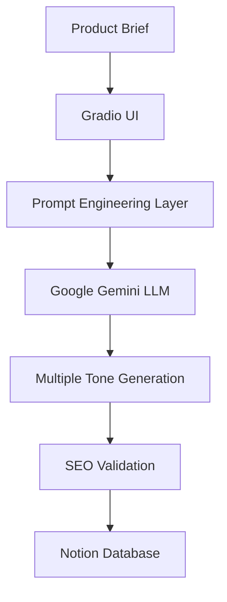
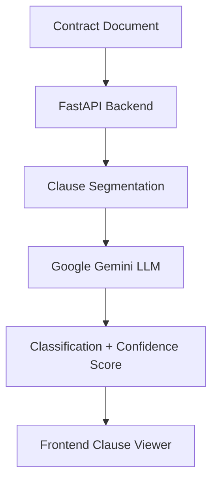

# 🤖 GenAI Projects Portfolio


A collection of hands-on **Generative AI applications** built using Large Language Models (LLMs), Retrieval-Augmented Generation (RAG), AI agents, APIs, and modern AI engineering practices.

These projects demonstrate practical implementations of GenAI concepts including prompt engineering, async LLM calls, document intelligence, knowledge retrieval, structured output generation, and AI-powered automation.

---

# 🚀 Projects

---

# 01. 🧠 RAG Assistant — Document Question Answering System

## Overview

A Retrieval-Augmented Generation (RAG) application that allows users to upload documents and ask questions using natural language.

The system retrieves relevant information from documents and generates accurate answers using an LLM with contextual grounding.

## Key Features

* Document ingestion pipeline
* Text chunking and preprocessing
* Embedding generation
* Vector database search
* Context-aware LLM responses
* Reduced hallucination through retrieval grounding

## Tech Stack

* Python
* LangChain
* OpenAI / Google Gemini LLMs
* Embeddings
* Vector Database
* RAG Architecture

---

# 02. 📄 Invoice Data Extractor

## Overview

An AI-powered invoice processing application that extracts structured information from invoices using Generative AI.

The application converts unstructured invoice documents into structured JSON data for automated processing.

## Key Features

* Invoice document analysis
* OCR + LLM extraction workflow
* Structured JSON generation
* Field validation
* Automated document processing

## Tech Stack

* Python
* Google Gemini API
* Document Processing
* JSON Extraction
* Streamlit

---

# 03. 🛍 Product Description Generator

## Overview

An AI-powered e-commerce content generation system that creates SEO-friendly product descriptions in multiple writing styles.

Users provide product information and the application generates multiple marketing variants using LLMs.

## Key Features

* Generate multiple tones:

  * Professional
  * Playful
  * Urgency-driven

* Async parallel LLM requests
* SEO meta description generation
* Prompt template engineering
* Save generated content to Notion database

## Architecture



## Tech Stack

* Python
* Google Gemini API
* Async Programming
* Gradio
* Notion API
* Prompt Engineering

---

# 04. ⚖️ Contract Clause Classifier

## Overview

An AI-powered legal document analysis application that automatically extracts contract clauses and classifies them into meaningful legal categories.

The application helps legal teams quickly identify important contract sections such as obligations, risks, intellectual property rights, and termination conditions.

## Key Features

* Contract clause extraction
* Clause segmentation
* AI-powered classification
* Legal category detection:

  * Obligation
  * Risk/Liability
  * IP/Ownership
  * Standard Boilerplate
  * Termination

* Confidence score generation
* AI reasoning explanation
* FastAPI REST API backend
* Async AI processing

## Architecture



## Tech Stack

* Python
* Google Gemini API
* FastAPI
* Pydantic
* Async Python
* REST APIs
* Pytest

---

# 05. 🏥 Medical Symptom Summarizer

## Overview

An AI assistant that summarizes user-provided symptoms into a structured medical summary.

The application helps organize information before consulting healthcare professionals.

## Key Features

* Symptom summarization
* Structured output generation
* Natural language processing
* AI-assisted information organization

## Tech Stack

* Python
* LLM APIs
* Prompt Engineering
* AI Workflows

---

# 🏗 GenAI Architecture Patterns Covered

## Prompt Engineering

* Role-based prompting
* Few-shot prompting
* Structured output prompting
* Persona-based generation
* Chain-of-thought style reasoning patterns

---

## Retrieval-Augmented Generation (RAG)

```text
Documents
    |
    ↓
Text Chunking
    |
    ↓
Embeddings
    |
    ↓
Vector Database
    |
    ↓
Retriever
    |
    ↓
LLM Response
```

---

## AI Agent Concepts

* Tool usage
* Multi-step workflows
* API integrations
* Autonomous task execution
* Agent-based automation

---

# 🛠 Technologies Used

| Category | Technologies |
|---|---|
| Languages | Python |
| LLMs | OpenAI GPT, Google Gemini |
| Frameworks | LangChain, Gradio, FastAPI |
| APIs | OpenAI API, Gemini API, Notion API |
| AI Patterns | RAG, Prompt Engineering, AI Agents |
| Backend | FastAPI, REST APIs |
| Data Processing | Document Intelligence, JSON Extraction |
| Testing | Pytest |
| Environment | Python Virtual Environments |

---

# 📂 Repository Structure

```text
GenAI-Projects/

├── README.md

├── 01-RAG-Assistant/

├── 02-InvoiceDataExtractor/

├── 03-Product-Description-Generator/

├── 04-Contract-Clause-Classifier/

└── Medical-symptom-summarizer/
```

---

# ⚙️ Running Projects Locally

Clone repository:

```bash
git clone <repository-url>

cd GenAI-Projects
```

Navigate into any project:

```bash
cd project-folder
```

Create virtual environment:

```bash
python -m venv venv

source venv/bin/activate
```

Install dependencies:

```bash
pip install -r requirements.txt
```

Configure environment variables:

```bash
cp .env.example .env
```

Run the application:

```bash
python app.py
```

---

# 🎯 Skills Demonstrated

✅ Generative AI Application Development  
✅ Large Language Model Integration  
✅ Google Gemini API Integration  
✅ Prompt Engineering  
✅ Retrieval-Augmented Generation (RAG)  
✅ Async LLM Processing  
✅ Document Intelligence  
✅ Legal AI Applications  
✅ FastAPI Backend Development  
✅ AI Workflow Automation  
✅ Structured Output Generation  
✅ AI Product Development  

---

# 📈 Future Enhancements

* Deploy applications on cloud platforms
* Add LangGraph-based AI agents
* Add multimodal AI capabilities
* Add LLM evaluation pipelines
* Add AI observability and monitoring
* Add CI/CD pipelines
* Add authentication and user management

---

# 👨‍💻 About

Built as part of continuous learning and experimentation with modern Generative AI technologies.

Focused on building practical AI applications that solve real-world business problems using LLMs, APIs, and AI engineering best practices.
